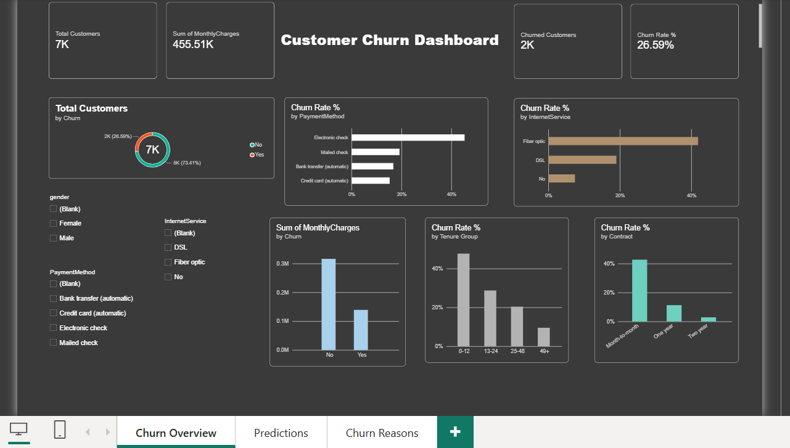
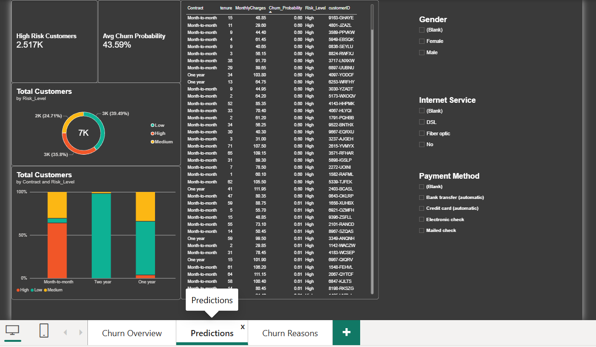
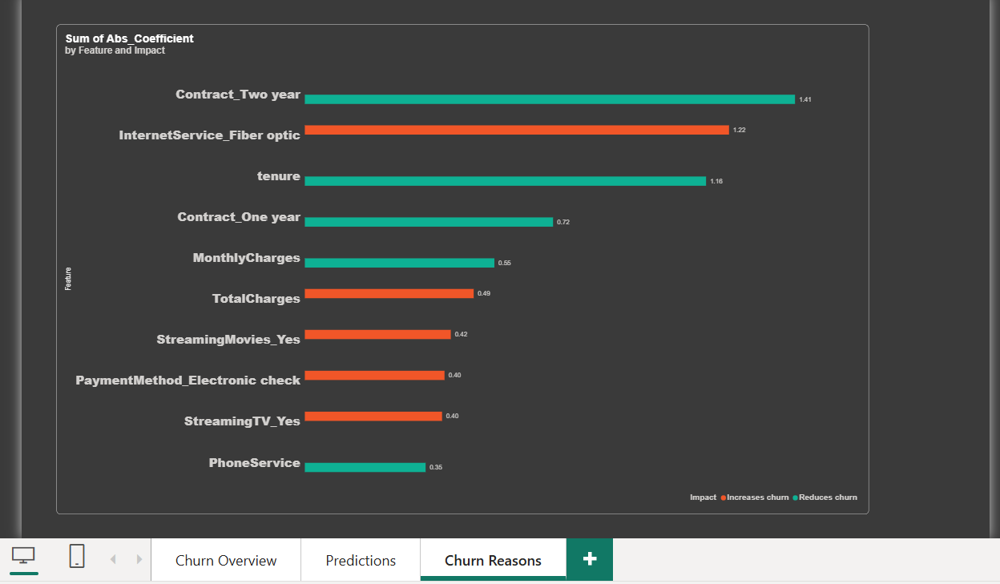

# Customer Churn Prediction System

An end-to-end churn project: a machine learning model, a Streamlit app for live predictions, and a Power BI dashboard for the whole customer base.

**Live app:** [churn-predictionsystem.streamlit.app](https://churn-predictionsystem.streamlit.app/)

## Key Results

| Metric | Score |
|---|---|
| ROC-AUC | 0.842 |
| Churn class recall | 0.78 |
| Churn class precision | 0.50 |

The model catches 78% of customers who actually churn. About half of the customers it flags as churners really do churn.

## Project Components

1. **ML model** (Logistic Regression): predicts whether a telecom customer will churn.
2. **Streamlit app**: enter a customer's details and get a live churn prediction.
3. **Power BI dashboard** (`powerbi/` folder) with three pages:
   - **Churn Overview**: who has churned so far (by contract, tenure, internet service, payment method)
   - **Predictions**: churn probability and risk level (Low/Medium/High) for every customer, plus a call list of high-risk customers
   - **Churn Reasons**: top 10 features that increase or reduce churn, taken from the model coefficients

## How the Model Connects to the Dashboard

- `export_predictions.py` runs the trained model on all 7,043 customers and saves `predictions.csv` (churn probability and risk level per customer).
- `export_reasons.py` saves the model coefficients to `reasons.csv`.
- Power BI joins `predictions.csv` with the Telco data on `customerID`.
- The CSV files are snapshots. After retraining the model, run both scripts again and refresh Power BI.

## Key Insights

- Month-to-month contracts, Fiber optic internet and Electronic check payments show the highest churn rates.
- Two-year contracts and longer tenure strongly reduce churn.
- 2,517 customers are classified as High risk.

## Dashboard Screenshots

## Tech Stack

Python, pandas, scikit-learn, Streamlit, Power BI

## Dataset

Telco Customer Churn (IBM sample dataset, Kaggle)